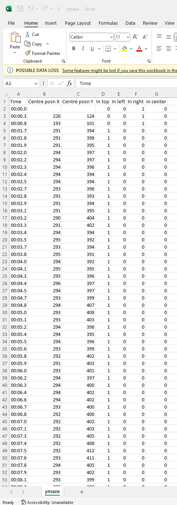
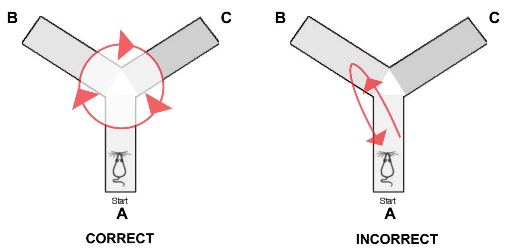

# Y-Maze Spontaneous Alternations

Extracts CSV file data that contains the mouse's X and Y coordinates and position value (1 or 0) with its timestamp. This streamlines the process of finding the total amount of Spontaneous Alternations and extracts the outputs into a text file.

## Table of Contents

- [Installation](#installation)
- [Usage](#usage)
- [Key](#key)

## Installation

**1. Clone Repository**
- ```
  git clone https://github.com/rrios119/Y-Maze-Spontaneous-Alternation.git
  ```

**2. Create/Activate Virtual Environment**
- For Windows:
  ```
  python -m venv venv
  venv\Scripts\activate
  ```
- For macOS/Linux:
  ```
  python -m venv venv
  source venv/bin/activate
  ```

**3. Install Python Dependencies**
- ```
  pip install -r requirements.txt
  ```

## Usage

**1. Check For Compatible CSV Format**
- File must be located in the same root directory as the index.py
- File should contain the columns 'In top', 'In left', and 'In right'
- The rows with the associated column should contain 0 or 1 (1 equates to the mouse's location)



**2. Run Index File**
- ```
  python index.py
  ```
- Input CSV File Name:
  ```
  ymaze.csv
  ```
- Input Desired Output Text File Name:
  ```
  output.txt
  ```

**3. View Data from Console or Output Text File**
- Contains the number of Unique Arm Entries, Total Arm Entries and Individual Arm Entries
- Contains the patterns of Unique Arm Entries and Total Arm Entries 
- Contains every Individual Arm Entry (C, A, B, C, B, C, A, C, B, etc)
- The text file should be located within the root directory of the index.py file

## Key

| Term    | Description                                    |
|---------|------------------------------------------------|
| Unique Arm Entry Pattern | Refers to the act of an animal entering three of the arms of the Y-Shaped Maze without repeating an arm entry within a specific period of time/trial (Ex: BAC, ABC, CBA).  |
| Arm Entry Pattern | Refers to the act of an animal entering three of the arms of the Y-Shaped Maze within a specific period of time/trial (Ex: AAC, CBC, ABC, BBA, CAB, etc). |
| Individual Arm Entry  | Refers to the act of an animal entering a single arm of the Y-Shaped Maze (Ex: C, A, B, C, B, C, A, C, B, etc).  |
| A | Refers to the 'In top' section from the CSV file; refers to the A-Arm of the Y-Maze |
| B | Refers to the 'In left' section from the CSV file; refers to the B-Arm of the Y-Maze |
| C | Refers to the 'In right' section from the CSV file; refers to the C-Arm of the Y-Maze |

